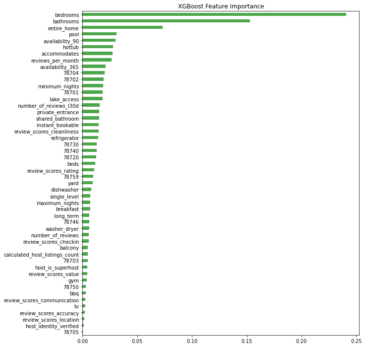

# Price Prediction For Airbnb Listings in Austin, TX

Airbnb is an online marketplace that connects people who are looking for short or long term rentals to property managers in that area. Airbnb currently covers more than 100,000 cities and 220 countries worldwide.

Although Airbnb and some other 3rd party website (e.g., beyondpricing.com) can help in pricing the units, the hosts still need to specify the base daily price, and then, those websites can change the price based on several factors such as seasonaility, day of the week, and any special events (e.g., national holiday,conferences, etc.). 

Many airbnb hosts, especially new and less experiences ones, might set a baseline for their unit which can be higher than the competitive pricing and marketing data which results on missing out on bookings or can be lower which results on leaving profits on the table. Therefore, Airbnb pricing is significantly important specially when competitiveness increases and more rental units become availble on Airbnb. In that case, even small difference in prices can make a big difference. According to the latest marketing data on rental units, competitive pricing can increase the revenue by at least 10%. Additionally, it is important to understand what factors (e.g., amenities) are more interesting to the guests, so we can come up with a strategy to attract more guests. 

The goal of this project is to solve this problem by predicting the base price of Airbnb units in Austin, using machine learning algorithms. In the following sections, I'm going to briefly describe the exploratory data analysis (EDA), followed by building several predictive models.

## Web Scraping

In this project, I scraped the Airbnb website to get the details of all available units in Austin, TX area on June 30, 2021. The units URLs were obtained from the available records on Insideairbnb.com website. Then, Selenium and BeautifulSoup were used to scrape the data from each Url, followed by storing the data in Mongo database.
After scraping the Airbnb website, the details of 10108 units with 74 features were obtained.

## Exploratory Data Analysis

I performed several steps of data-preprocessing on the dataset. I removed several unnecessary features (e.g., host ID) and the rows with null values in price or rating. I extracted the most common features from available amenities (e.g. pool, hottub, washer/dryer). Also, I handled categorical data type using one-hot-encoding (e.g. zipcode). The following figure shows the price distribution based on the zipcode.

I clustered the 45 zipcodes into 11 zipcodes based on their proximity and neighborhood vibe. The following figure shows the price distribution for clustered zipcodes.

The other important features that I extracted are whether the rooms or bathroom shared or private. The following figures show that the price range is substantially higher when the rooms or bathrooms are private.

The following figures show the price distribution versus the number of beds, bedrooms, bathrooms, and the number of people which the listing can accomodate. There are linear retationships between the price range and these features.

Finally, the following figure shows the histogram of Airbnb listing prices in Austin. The right figure shows the number of units with prices less than $2500, and the left figure shows the numbers on y-axis in logarithmic scale. Based on the data, the mean and median listing price of Airbnb units in Austin are $220 and $139, accordingly.

## Machine Learning Models

In this section, I build three models using random forest, gradient boosting, and XGBoost to predict the listing prices. I used 80% of the data for my training set and 20% for the test set. In addition, I used gridsearch algorithm to tune the hyper-parameters to achieve higher scores.

### Random Forest Method
For the first step, I build a random forest model and fit that to my training dataset. Then, I used gridsearch algorithm to tune my hyperparameters. Finally, I used the following values for my hyper-parameters:
* max_features: 16
* max_depth: 16
* min_samples_split=16
* number of trees: 600

By using the random forest, I got the following results for my training and test dataset. As can be seen from the following two figures, the model overfits the training set. Also, the model has relatively good accuracy at listing price of less than $500. However, it seems that the model is underpredicting the listing prices more than $500. I took a more detailed look at these houses and will explain my finding in the last part of this section.

<table border=1 >
  <thead>
  <td>
    
<b>Training dataset</b>
  </td>
  <td>
    
<b>Testing Dataset</b>
  </td>
  </thead>
  <tr>
  <td colspan=2 >
    
  </td>
  </tr>
  <tr>
  <td>
    
R2 score = 0.95
  </td>
  <td>
    
R2 score = 0.66
  </td>
  </tr>
  <tr>
  <td>
    
RMSE score = 55
  </td>
  <td>
    
RMSE score = 145
  </td>
  </tr>
</table>

### Gradient Boost Method
Then, I build a gradient boost model and fit that to my training dataset. Then, I used gridsearch algorithm to tune my hyperparameters. Finally, I used the following values for my hyper-parameters:
* learning_rate: 0.02
* max_features: 0.1
* max_depth: 8
* min_samples_split=10
* number of trees: 1000

<table border=1 >
  <thead>
  <td>
    
<b>Training dataset</b>
  </td>
  <td>
    
<b>Testing Dataset</b>
  </td>
  </thead>
  <tr>
  <td colspan=2 >
    
  </td>
  </tr>
  <tr>
  <td>
    
R2 score = 0.97
  </td>
  <td>
    
R2 score = 0.69
  </td>
  </tr>
  <tr>
  <td>
    
RMSE score = 39
  </td>
  <td>
    
RMSE score = 137
  </td>
  </tr>
</table>

### XGBoost Method
Then, I build an XGBoost model and fit that to my training dataset. Then, I used gridsearch algorithm to tune my hyperparameters. Finally, I used the following values for my hyper-parameters:
* colsample_bytree=0.6
* gamma=0.3
* learning_rate=0.3
* max_depth=5
* n_estimators=100

<table border=1 >
  <thead>
  <td>
    
<b>Training dataset</b>
  </td>
  <td>
    
<b>Testing Dataset</b>
  </td>
  </thead>
  <tr>
  <td colspan=2 >
    
  </td>
  </tr>
  <tr>
  <td>
    
R2 score = 0.96
  </td>
  <td>
    
R2 score = 0.76
  </td>
  </tr>
  <tr>
  <td>
    
RMSE score = 38
  </td>
  <td>
    
RMSE score = 123
  </td>
  </tr>
</table>

Finally, I plotted the feature importance of the various features using XGBoost algorithm to explain the pricing of Airbnb houses in Austin. It is not surprising that the most important feature is how many people the property accommodates, as that’s one of the main things you would use to search for properties in the first place. It is also not surprising that features related to number of bathrooms, private vs shared, location, reviews, and some amenities such as pool and huttub are in the top ten.

## Price Prediction Error
In the last step, I dig deep into the model to understand the reason for underprediction at listing price above $800. The following figure show the residual in price prediction. It can be seen that the residual is skewed  with tendency to underprediction.

If I filter the properties with price higher than $800 and fit another XGBoost model, the residual distribution will be the following figure. It is observed that the error for 95% of the properties under $800 is less than $100 per night. Therefore, the properties above $800 are less predictable.

## Analysis of Higher Price Listings

Among over $800 per night properties, there were several overpriced listings without having any specific features. In other words, you can find other airbnb properties in that same area with the nearly similar features at much lower price. In other words, there is a lot of noise in the higher price range. The following two listings is a good example of noise.

|  |  |
|       ---        |       ---         |
| <b>
Basic | <b>
Luxury |

However, there were house with some specifications that the ML models have not been trained on. These features were not mentioned explicitly in the amenities section and were only included in the description part such as house with views, salt pool, or home theatres. Hence, one of the future step of this project is to extract those specific features by using NLP on the description and reviews sections.

## Future Work

* Include features that are not being included in the amenities part. This task can be done using NLP on house descriptions and/or reviews sections.

* Continously scraping from Austin Airbnb website to include the seasonaility on the listing price.

* Create a user-friendly dashboard for property managers.